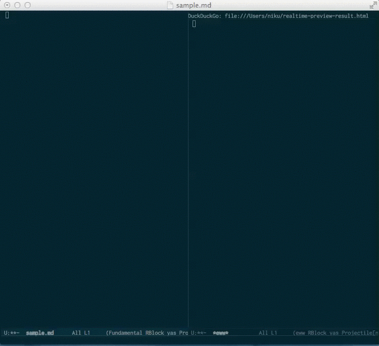

# markdown-live-eww-preview-mode

This is a fork of the original mardown-preview-eww. I opted to make it a major emacs
mode as well as improving the hook so again the changes are displayed live (didn't 
work for me on the original repo).

Realtime preview by eww.

## How to use

install redcarpet from gem `% gem install redcarpet`

Open markdown file using emacs.

Execute `markdown-preview-eww`

## Requirements

- Emacs24.4 or higher
- eww (embedded in Emacs24.4)
- Ruby
- [redcarpet](https://github.com/vmg/redcarpet)
